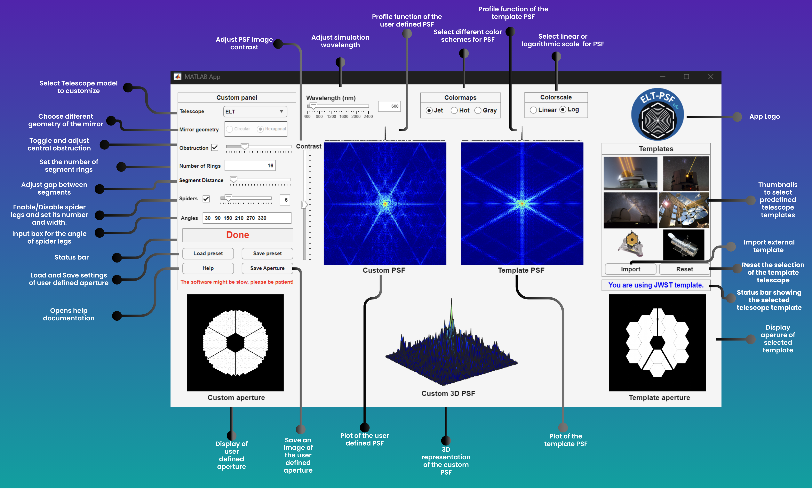

# ELT-PSF_edu

ELT-PSF_edu is a simplified, pedagogical version inspired by the professional software used by astronomers to model the JWST's PSFs (WebbPSF tool).
It is design as an educational software tool that can simulate the diffraction effects of the ELT and demonstrate how its optical design influences the resulting image.

# Software User Manual

## Installation and Configuration Instructions

The **ELT-PSF[edu]** software is developed using **MATLAB App Designer** and requires a working installation of MATLAB to run.  
To ensure compatibility, **MATLAB version R2025b** is recommended, as it provides full support for graphical interfaces and numerical computation tools used in the application.

To install the software:

1. Download or clone the repository.
2. Extract the software folder to your local computer.
3. Ensure the main **`.mlapp`** file remains inside the extracted folder.

No additional external libraries are required because all computations rely on built-in MATLAB functions.

### Running the Application

Once MATLAB is launched, the application can be opened in two ways:

- Navigate to the application folder and **double-click the `.mlapp` file**, or  
- Open it directly through the **MATLAB App Designer interface**.

Make sure that the **MATLAB working directory is set to the application folder**.

When the application starts, all graphical interface components are initialized automatically.  
No manual configuration is required for first-time use.

---

# Guide for Using the Software

After launching **ELT-PSF[edu]**, the user is presented with the main graphical interface.

The typical workflow begins by:

1. Selecting a **built-in telescope template**, or  
2. Choosing **Custom mode** to modify the optical parameters.

Users can adjust parameters such as:

- Aperture diameter
- Mirror segmentation
- Telescope geometry

The resulting **Point Spread Functions (PSFs)** can then be compared with predefined telescope configurations whose geometry cannot be modified.

### Parameter Adjustment

Parameters can be modified using:

- Sliders
- Dropdown menus
- Numeric input fields

Any change in parameters automatically triggers a **recalculation of the PSF**, providing almost immediate visual feedback.

### Visualization Options

After computation, the user can explore several visualization modes, including:

- **2D PSF images**
- **3D PSF visualizations**
- **Intensity profiles**

These visualizations update dynamically based on the selected display options.

### Exporting Results

Simulation outputs can be exported, including:

- PSF images
- Resulting PSF datasets
- 3D PSF plots

Users can also **save and reload aperture geometry presets**, making it possible to reproduce or share experiments.

---

# Description of GUI Elements

The ELT-PSF[edu] interface is organized into:

- **Three control areas**
- **Four visualization panels**

The layout enables **side-by-side comparison** between:

- a **user-defined (custom) aperture**
- a **predefined (template) telescope configuration**

---

## Custom Panel (Left)

The **Custom panel** contains controls used to create and modify a user-defined telescope aperture.

Available options include:

- Selecting the **telescope model**
- Choosing **mirror geometry** (circular or hexagonal)
- Enabling or adjusting a **central obstruction**

### Aperture Segmentation

Segmentation is controlled through:

- Number of **segment rings**
- **Inter-segment gap** (spacing between mirror segments)

### Spider Vanes

Optional **spider vanes** can be enabled with adjustable parameters:

- Number of vanes
- Vane width
- Angular orientation (in degrees)

### Additional Controls

The panel also includes buttons to:

- **Load presets**
- **Save presets**
- Open the **Help documentation**
- **Export the custom aperture image**

A **status message area** provides feedback, for example:

- Warning about computational performance
- Notifications of invalid configurations

---

## Global Simulation and Display Controls (Top)

Global controls allow users to adjust simulation and visualization settings.

### Wavelength Control
Sets the **simulation wavelength** (in nanometers).

### Contrast Slider
Adjusts the **dynamic range of the PSF visualization**.  
This only affects how the PSF is displayed and **does not change the numerical PSF calculation**.

### Display Options

Users can also:

- Select different **colormaps**
- Switch between **linear intensity scale**
- Switch to **logarithmic intensity scale**

Logarithmic scaling is particularly useful for highlighting **faint diffraction structures**.

---

## Template Panel (Right)

The **Templates panel** allows users to select predefined telescope configurations.

Templates are presented as **thumbnail images**.

Features include:

- Display of the **currently selected template**
- Visualization of the **template aperture geometry**
- Ability to **import external templates**
- Option to **reset the template selection**

---

## Visualization Panels (Center and Bottom)

The interface includes multiple visualization outputs for analyzing PSF behavior.

### Custom PSF (2D)
Diffraction-limited PSF computed from the **user-defined aperture**.

### Template PSF (2D)
PSF corresponding to the selected **predefined telescope template**.

### Aperture Displays
Binary pupil masks used for the simulations:

- Custom aperture
- Template aperture

### Custom PSF (3D)
A **3D surface rendering** of the PSF intensity distribution, illustrating:

- Diffraction core
- Diffraction sidelobes

### PSF Intensity Profiles

The interface also shows **PSF intensity profiles** extracted from the PSF.  
These profiles allow quantitative comparison of:

- PSF width
- Peak intensity
- Diffraction structure

This makes it easier to analyze how **different telescope configurations affect optical performance**.
